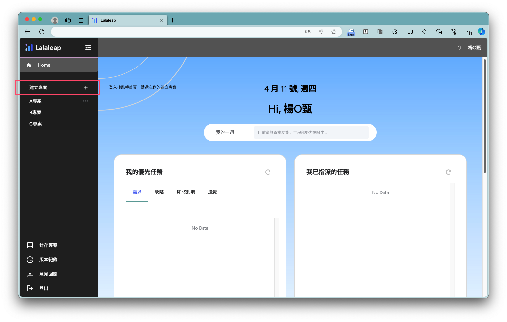
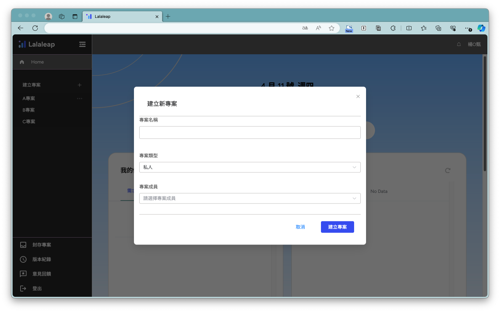
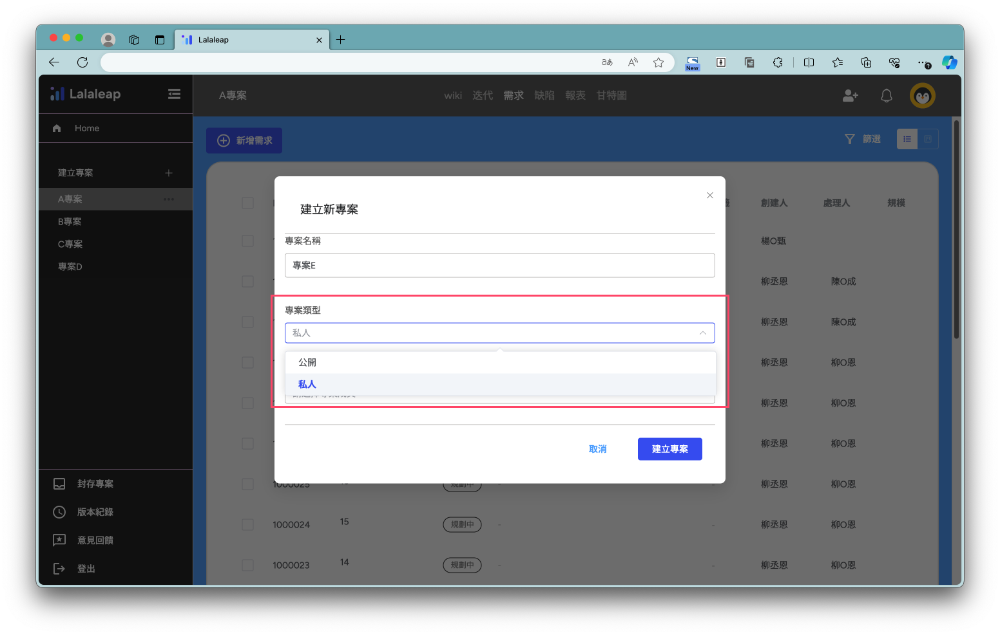
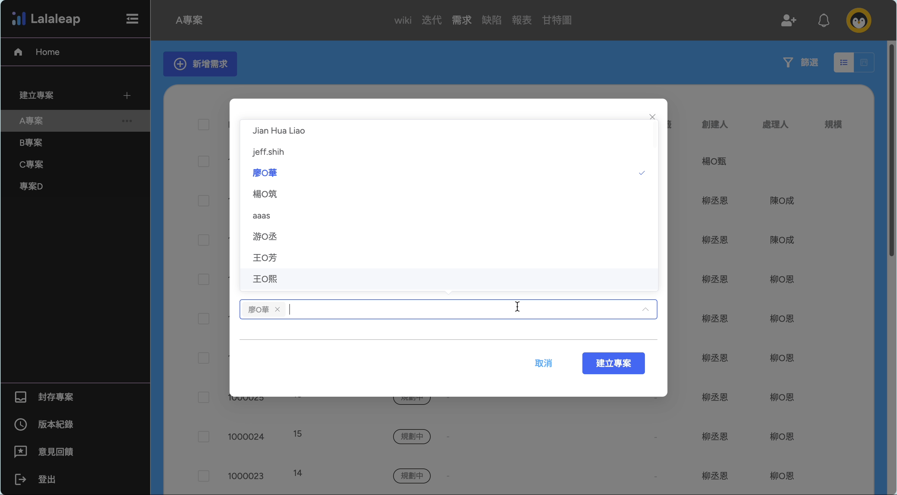
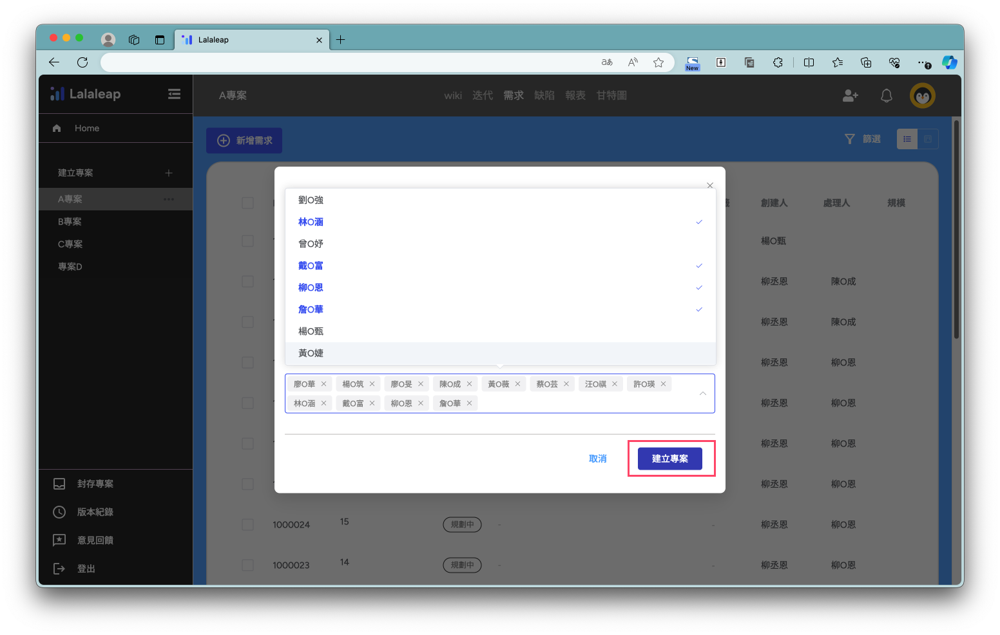
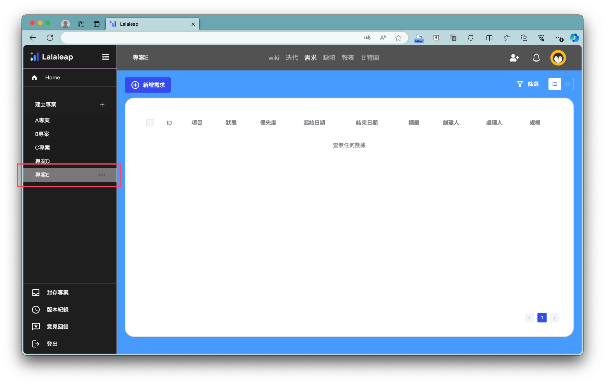

# 建立新專案

## 新增
在左側功能選單中，點選【建立專案＋】

## 填寫專案資訊
彈出建立專案功能視窗，需輸入①專案名稱、②選擇專案類型、③選擇專案成員

1.輸入一個專案名稱，名稱在建立後可修改

2.選擇專案類型；
選擇【公開】項目對所有成員公開、選擇【私人】項目僅對選擇的專案成員公開

3.選擇可以看到專案的成員

從展開選單中選取專案的成員，可以點選【✖】來移除成員

## 建立完成
完成三個填寫項目後點選【建立專案】按鈕

建立專案後後關閉功能視窗，新建立的專案顯示在左側選單中

### 恭喜，你已經成功建立專案了！🎊🎉
建立完專案後，可以開始建立專案內容了
你可以點選[專案設定](project_set.md)來繼續建立專案內容！