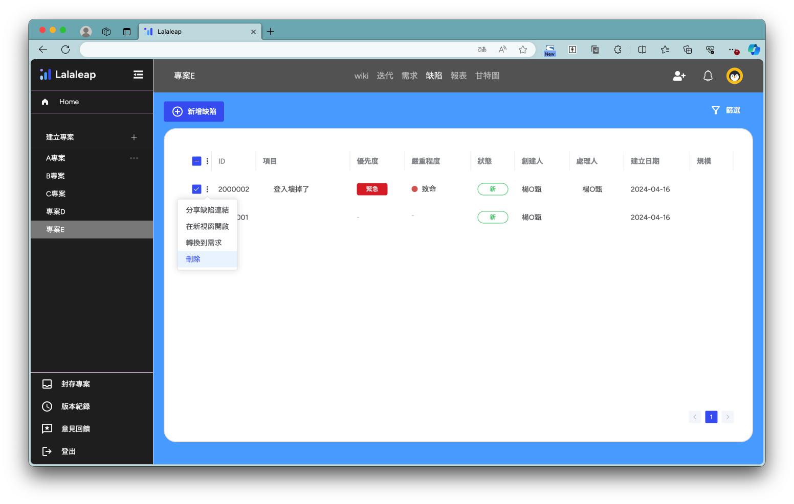
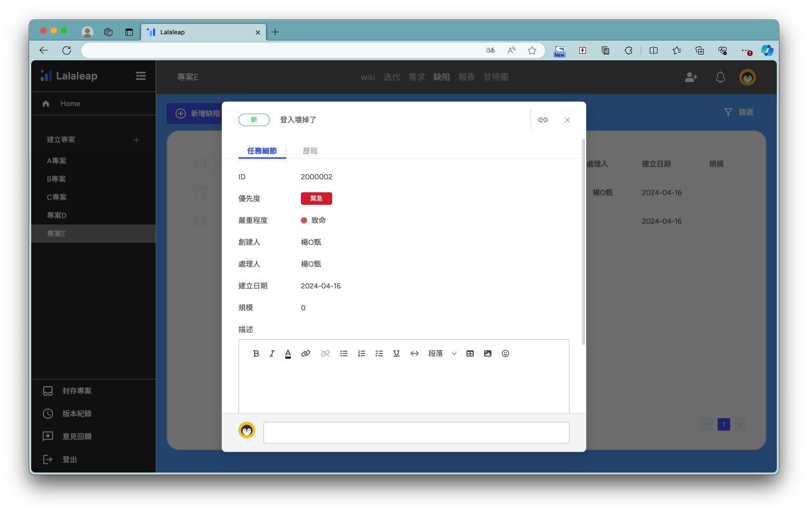
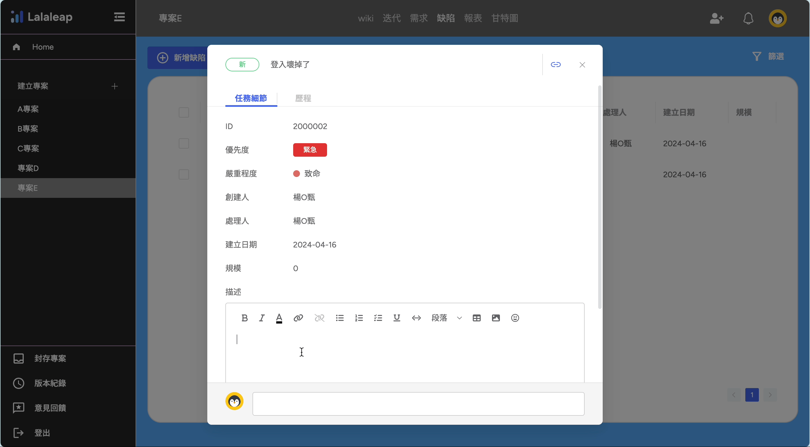
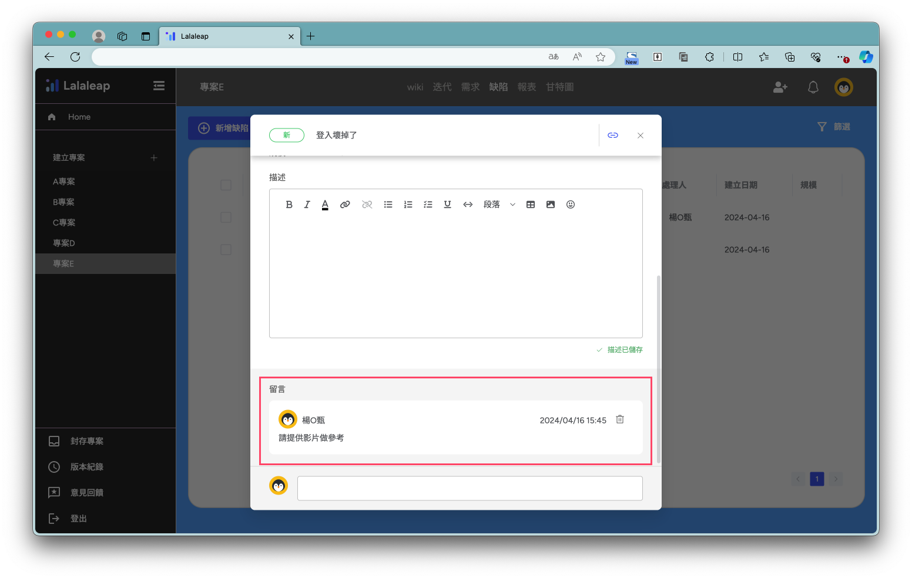
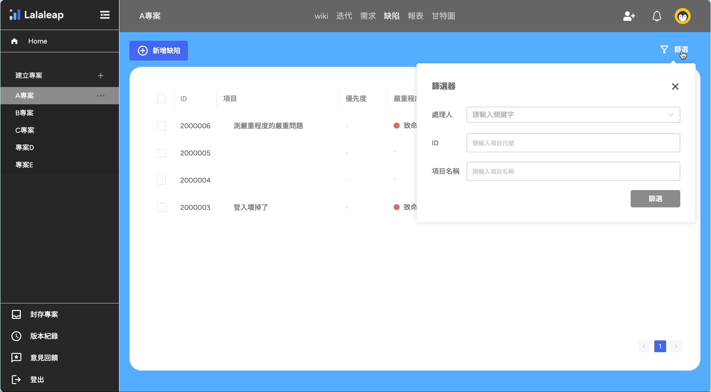

# 專案缺陷設定

### 1.新增

點選【+新增缺陷】按鈕可以新增一筆項目

### 2.缺陷項目設定

新增項目後可以直接在列表上進行編輯，輸入需求項目見下圖 👇

- □：勾選 checkbox 後會顯示選單對需求項目進行編輯
- ID：自動生成，點選 ID🔗 彈出設定需求項目的功能視窗
- 項目：輸入項目名稱
- 選擇優先度：設定優先度
- 嚴重程度：設定嚴重程度
- 狀態：選擇狀態
- 創建人：自動帶入新增需求的人員
- 處理人：選擇處理人員
- 建立日期：選擇結束日期
- 規模：輸入規模

#### 2-1.勾選 checkbox 展開功能選單

- 分享需求連結：複製連結
- 在新視窗開啟：另開新視窗
- 轉換到需求：將項目移轉到需求列表
- 刪除：刪除勾選項目

#### 2-2.點選【ID】彈出設定需求項目的功能視窗

- 可以編輯項目及需求詳細內容 ✏
  
  :::info
  :bulb:編輯器提供文字編輯及貼上圖片！
  
  :::

- 點選置底處的對話框可進行留言
  
  

## 篩選功能

點選篩選彈出篩選器功能視窗，可設定篩選條來過濾需求列表見下圖 👇

