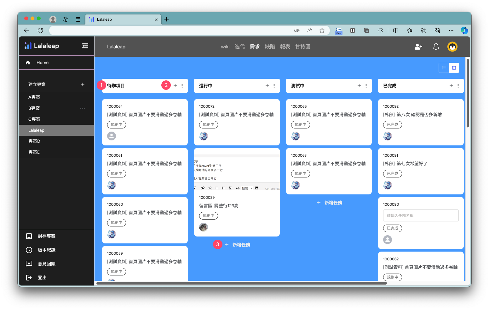
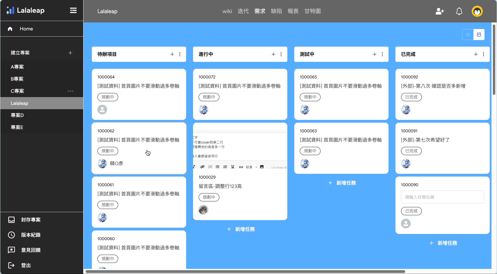

# 需求-牌卡

## 切換列表顯示方式

點選{width=70 style=display:inline;}可切換成清單或卡片顯示方式見下圖 👇

## 牌卡列表

- ① 分類名稱
- ② 點選{width=25 style=display:inline;}新增一張任務牌卡、點選{width=25 style=display:inline;}編輯或刪除區塊
- ③ 點選【+新增任務】新增一張任務牌卡

拖移牌卡可改變分類群組

