# 專案設定

### 1.專案功能頁

① 專案名稱、② 專案功能標籤，點選標籤可切換顯示對應功能列表、③ 功能按鈕列
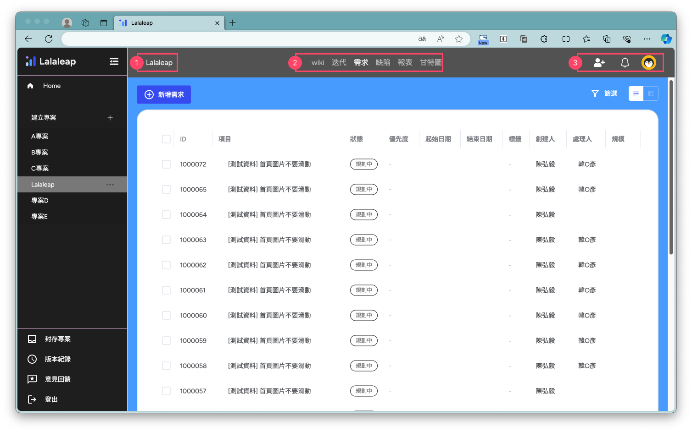
點選{width=30 style=display:inline;}編輯專案成員

點選專案成員旁的 ICON{width=20 style=display:inline;}打開選單可以刪除成員
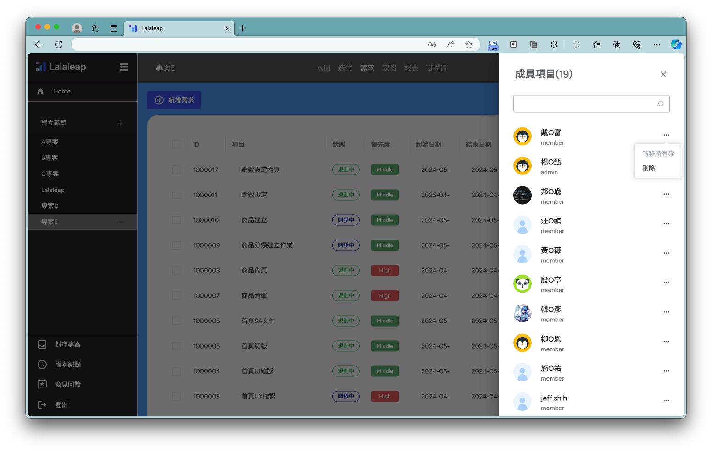
可透過搜尋加入專案成員
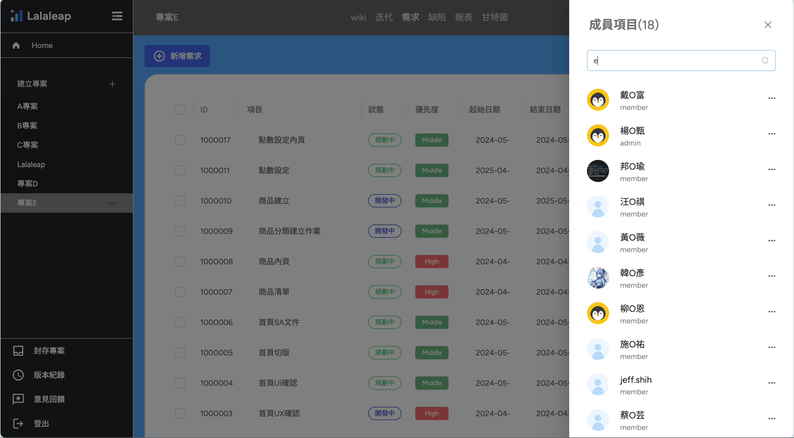

### 2.編輯專案資訊

點選左側選單專案旁的 icon 展開編輯選單
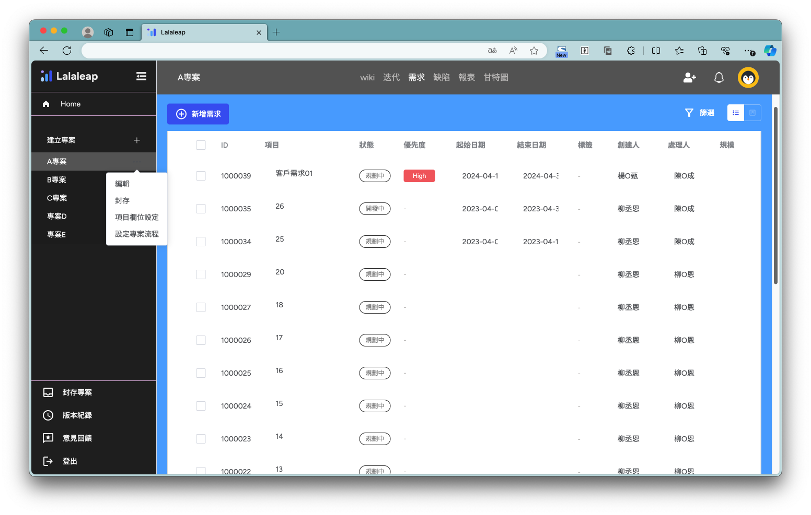

#### 2-1.編輯

修改專案名稱
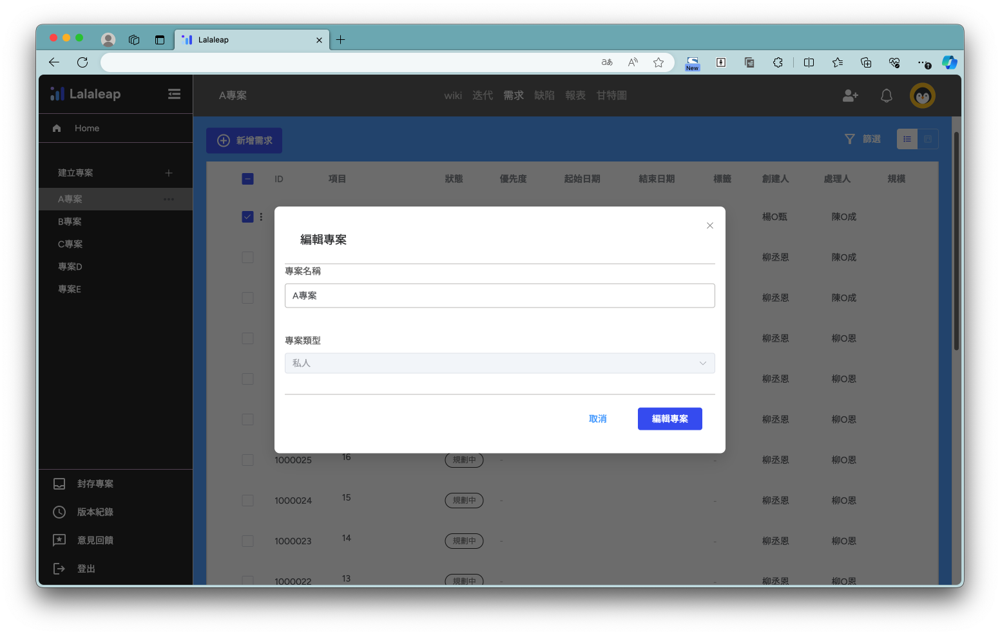

#### 2-2.封存

封存專案後，只有自己可以看到專案

#### 2-3.項目欄位設定

- 可編輯專案需求列表的欄位

  - 拖拉項目改變順序
  - 點選{width=30 style=display:inline;} 可以編輯項目
  - 點選{width=30 style=display:inline;} 可以刪除項目
    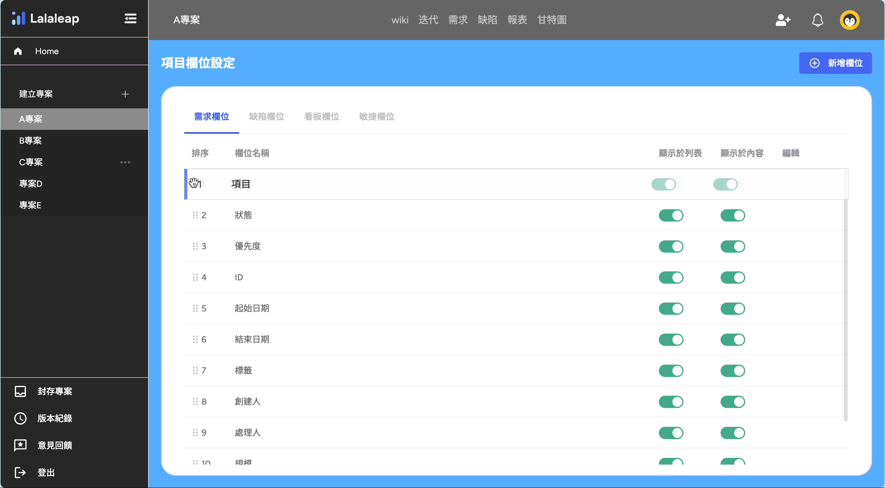

- 新增欄位
  - 點選【+新增欄位】按鈕
    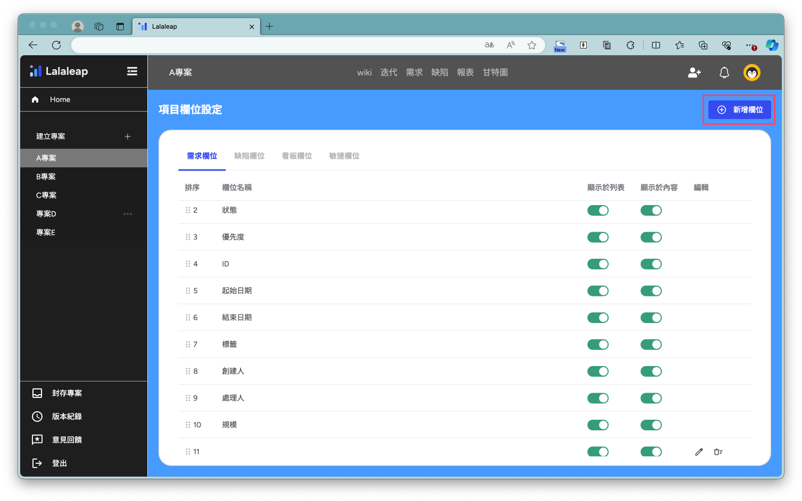
  - 輸入欄位名稱，選擇欄位類型完成設定後，點選【儲存設定】
  - 選項類型包含：文字、數值、標籤、下拉、顏色下拉、顏色點點下拉、日期、使用者、日期起迄、確認、檔案、流程
    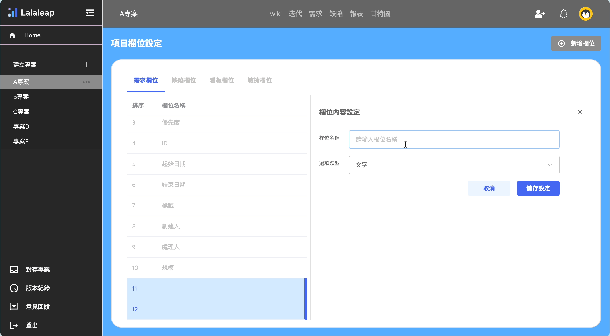

#### 2-4.設定任務流程

建立任務狀態及設定任務執行流程
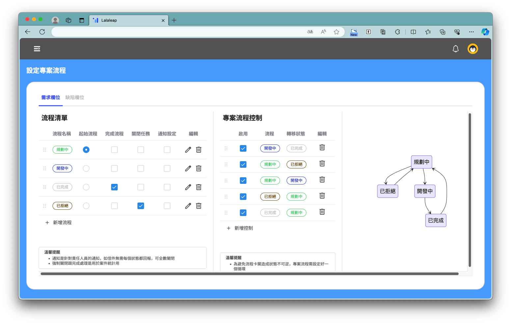

- 點選【+增加流程】新增一筆項目，輸入流程名稱及設定顏色
  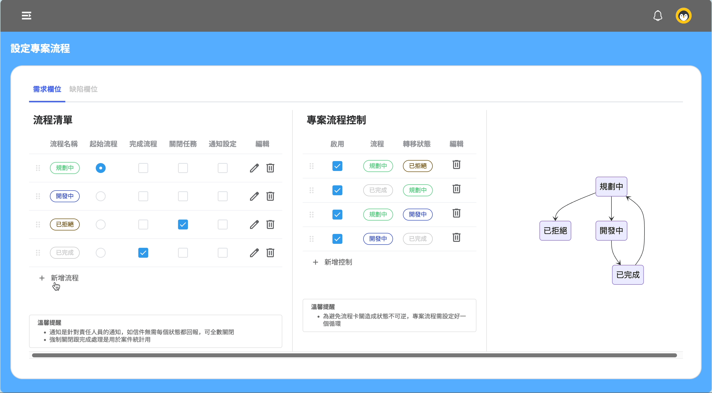
- 新增完流程標籤後，在流程中加入任務標籤順序
  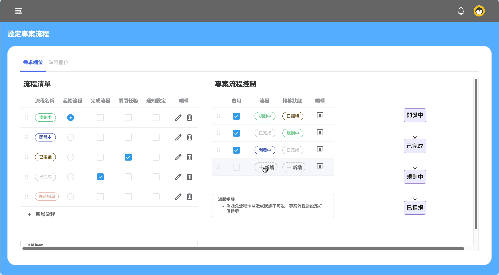
