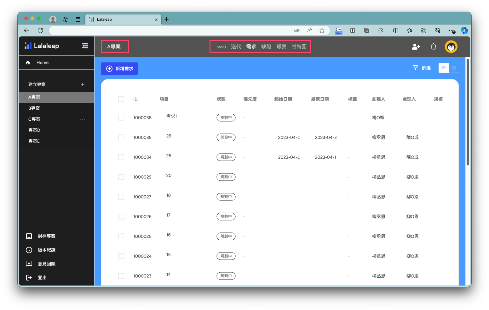
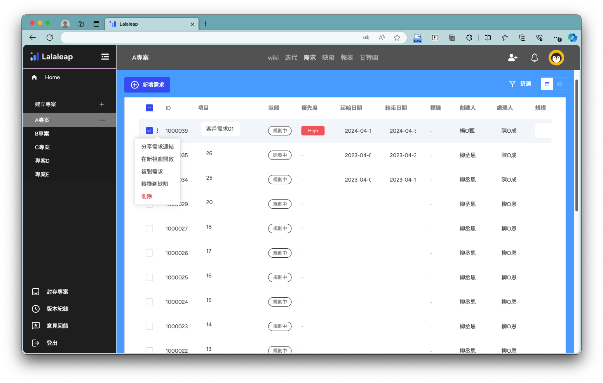
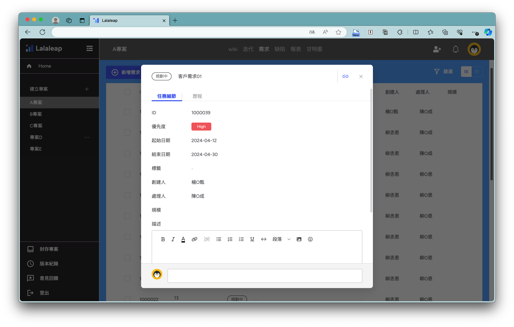
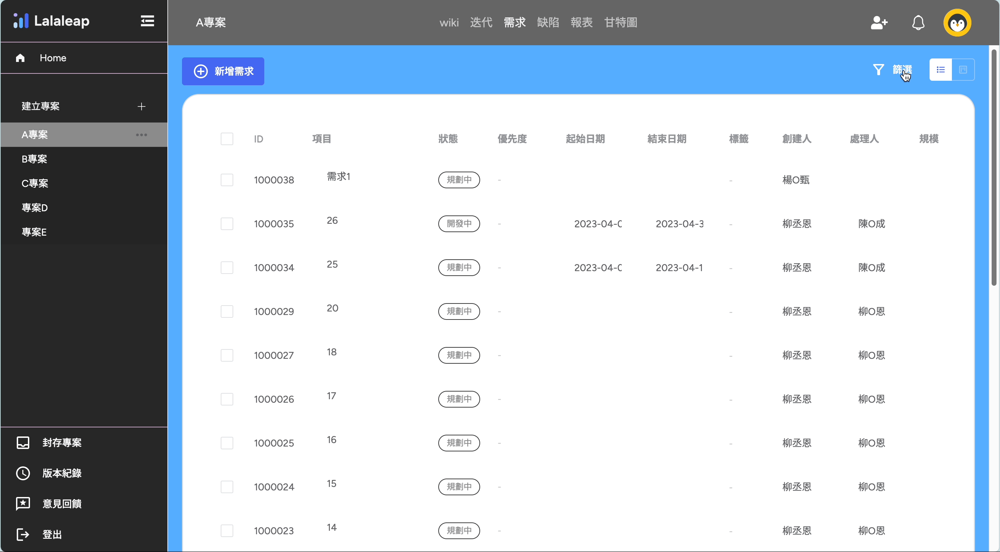

# 專案設定

### 專案設定頁面功能介紹
***
1.選擇專案後，預設選取【需求】的功能項目，並列出專案的需求列表

2.點選左側選單專案旁的icon展開編輯選單

- 編輯：彈出編輯功能選單
- 封存：封存專案
- 項目欄位設定：調整欄位項目
- 設定專案流程：設定專案流程中的通知項目

2-1.編輯專案功能視窗

2-3

### 需求項目設定
***
1.選擇【+新增需求】按鈕可以新增一筆項目
2.新增項目後可以直接在列表上進行編輯，輸入需求項目見下圖👇

- □：勾選checkbox後會顯示選單對需求項目進行編輯
- ID：自動生成，點選ID🔗彈出設定需求項目的功能視窗
- 項目：輸入項目名稱
- 選擇狀態：規劃中、開發中、已拒絕
- 選擇優先度：高、中、低
- 起始日期：選擇起始日期
- 結束日期：選擇結束日期
- 標籤：輸入標籤
- 創建人：自動帶入新增需求的人員
- 處理人：選擇處理人員
- 規模：輸入規模

2-1.勾選checkbox展開功能選單

- 分享需求連結：輸入標籤
- 在新視窗開啟：自動帶入新增需求的人員
- 複製需求：選擇處理人員
- 轉換到缺陷：將項目移轉到缺陷列表
- 刪除：刪除勾選項目

2-2.點選【ID】彈出設定需求項目的功能視窗，可以編輯項目及需求詳細內容✏

:::info
:bulb:編輯器提供文字編輯及貼上圖片！
 
:::

### 篩選功能
***
點選篩選彈出篩選器功能視窗，可設定篩選條來過濾需求列表見下圖👇

### 切換列表顯示方式
***
可切換成清單或卡片顯示方式見下圖👇

