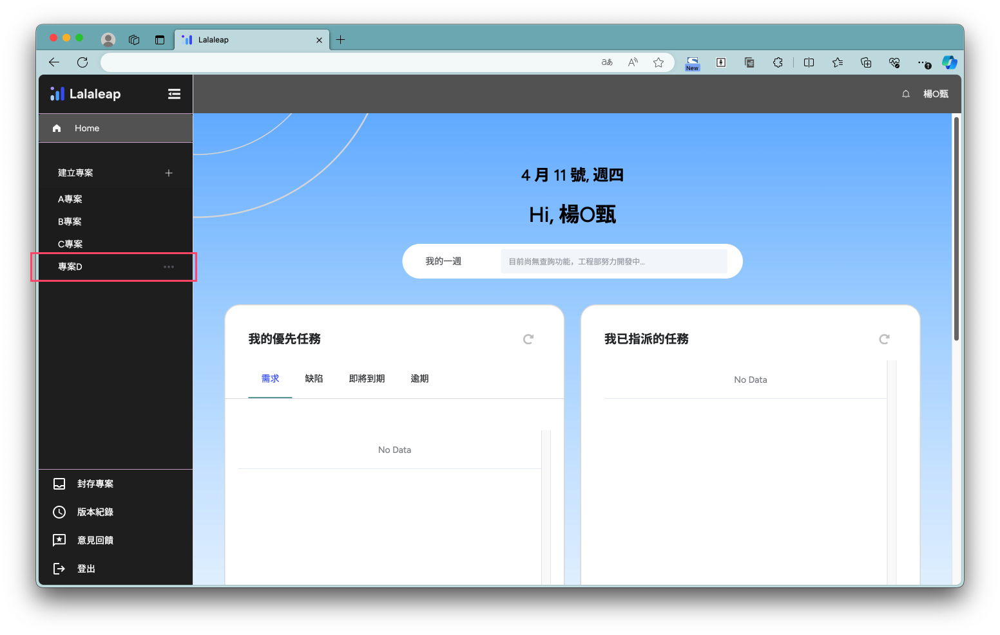
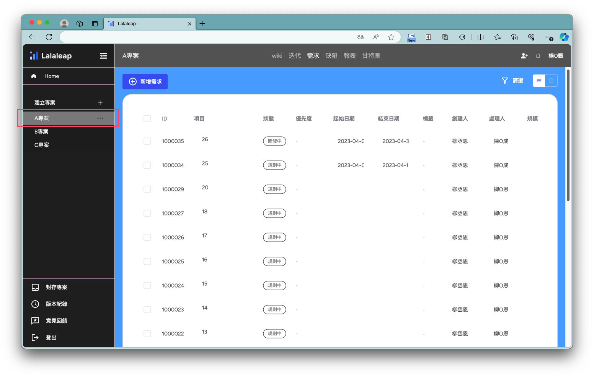
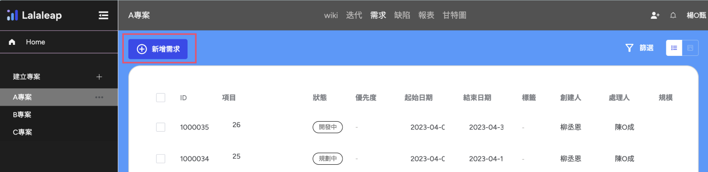
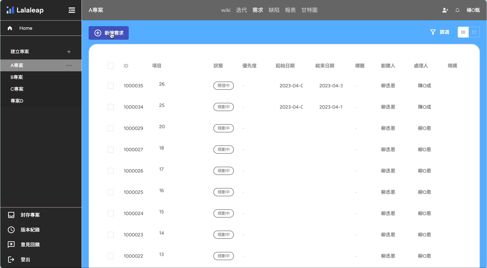

# 快速上手

### 登入方式
*** 
您可以透過第三方平台登入 lalaleap。

### 如何建立專案？
***

登入後會先跳轉個人首頁，在左側功能選單中，選擇【建立專案＋】，按下後彈出建立新專案的功能視窗，填寫完專案資訊後按下【建立專案】按鈕。見下圖👇

1.點選【建立專案＋】

2.填寫專案資訊、專案類型及選取專案人員

3.建立完成的專案會顯示在左側選單中

### 如何建立需求？
***

從左側選單中選擇要新增需求的專案

點選【+新增需求】按鈕

點選按鈕後，立即在清單上新增一筆資料，見下圖👇

### 🎉恭喜，你已完成快速入門！🎊
你剛完成了lalaleap的快速入門！
還有非常多功能等待你探索~🔍
你可以回到[使用教學](markdown-examples.md)查找豐富完整的功能！