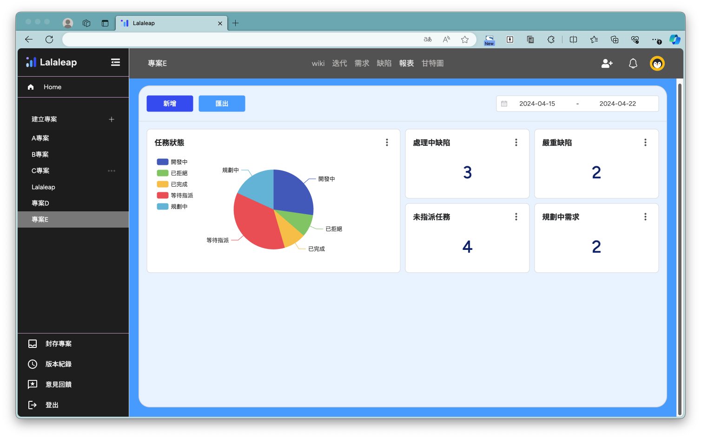
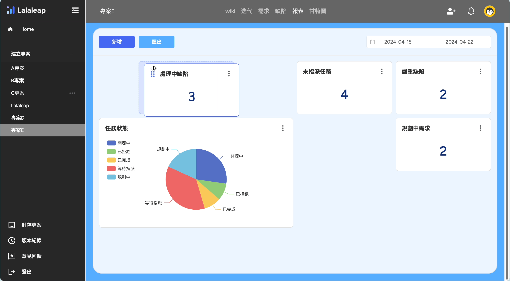
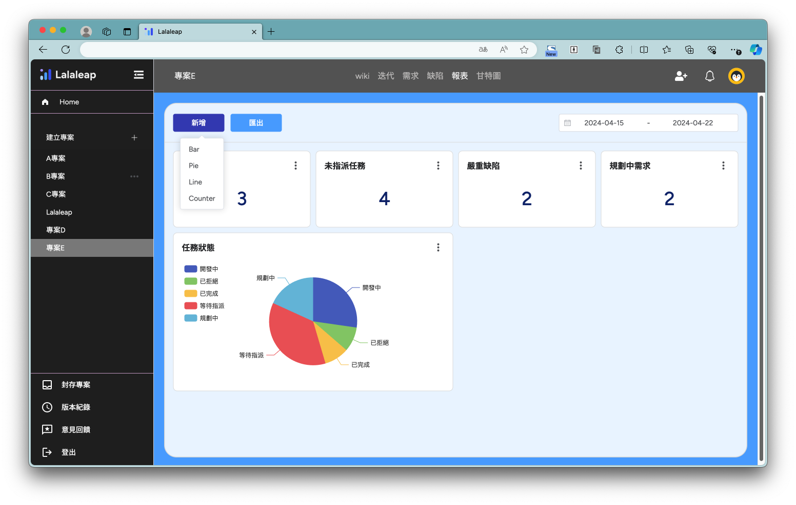
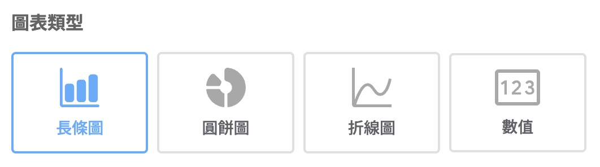
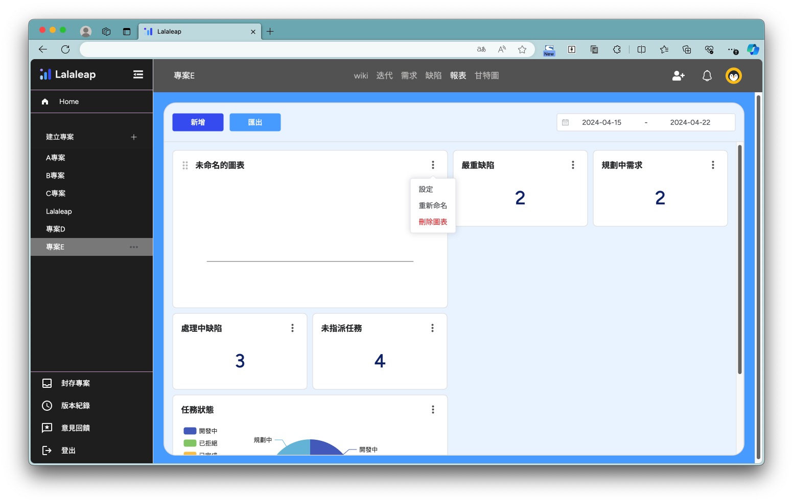

# 報表

### 1.報表頁面

預設查詢一週內的任務報表

- 可拖拉圖表改變排版見下圖 👇
  

### 2.新增圖表

點選【新增】按鈕展開報表類型選單

提供四種圖表類型

新增完圖表後打開選單，透過【設定】來編輯圖表

#### 2-1.長條圖

- 設定圖表標題
- 選擇分群來源：需求、缺陷、全部
- X 軸：設定 X 軸資料來源
- Y 軸：設定 Y 軸資料來源
- 計算方式
  

#### 2-2.圓餅圖

- 設定圖表標題
- 選擇分群來源：需求、缺陷、全部
- 選擇群組內容：優先度、嚴重程度、狀態、處理人
- 圖表排序與單位設定：數值、百分比
  
